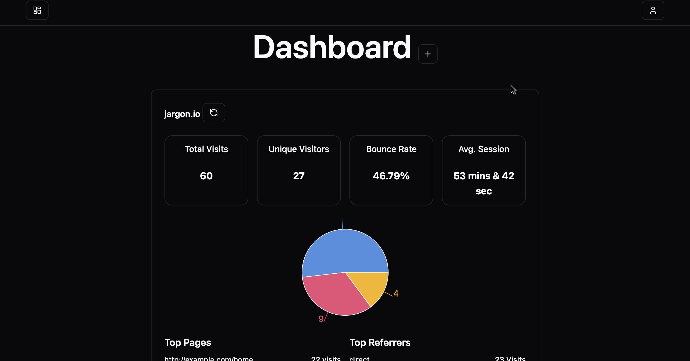
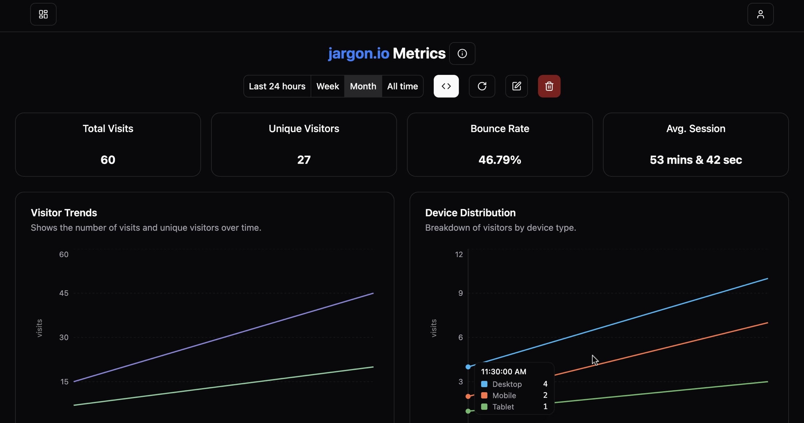

## Overview
This is the frontend of the web platform built with React, TypeScript, Vite, and Tailwind CSS. It provides authentication, a dashboard, and metric visualization for users.

## Tech Stack
- **React 19**: UI framework
- **Vite**: Build tool for fast development
- **TypeScript**: Strongly typed JavaScript
- **React Router**: Client-side routing
- **Tailwind CSS**: Utility-first styling
- **Radix UI**: Accessible UI components
- **Framer Motion**: Animations
- **Recharts**: Data visualization

## Installation

Clone the repository and install dependencies:

```sh
npm install
```

## Development

To start the development server:

```sh
npm run dev
```

## Build

To create a production build:

```sh
npm run build
```

## Linting

To check for linting errors:

```sh
npm run lint
```

## Folder Structure
```
client/
├── src/
│   ├── auth/          # Authentication pages
│   ├── components/    # Reusable UI components
│   ├── dashboard/     # Dashboard UI
│   ├── errors/        # Error pages (404, etc.)
│   ├── metrics/       # Metrics visualization
│   ├── profile/       # User profile page
│   ├── App.tsx        # Main application component
│   ├── index.tsx      # Entry point
│   ├── index.css      # Global styles
│   ├── theme-provider.tsx  # Theme management
│   ├── routes.tsx     # Centralized route management
```

## Routing

The application uses React Router:

| Route              | Component    | Description                      |
|--------------------|-------------|----------------------------------|
| `/`                | `App.tsx`    | Main landing page               |
| `/auth/signin`     | `SignIn.tsx` | User sign-in                    |
| `/auth/signup`     | `SignUp.tsx` | User registration               |
| `/auth/twoauth`    | `TwoAuth.tsx`| Two-factor authentication       |
| `/dashboard`       | `Dashboard.tsx` | User dashboard              |
| `/profile`         | `ProfilePage.tsx` | User profile page          |
| `/metrics/:id/:period` | `Metric.tsx` | Metric details page        |
| `*`                | `UnAvailable.tsx` | 404 error page           |

## Theming
The app supports dark and light themes using `next-themes` and a custom `ThemeProvider`.

## Screenshots


## License
This project is licensed under [MIT License](LICENSE).